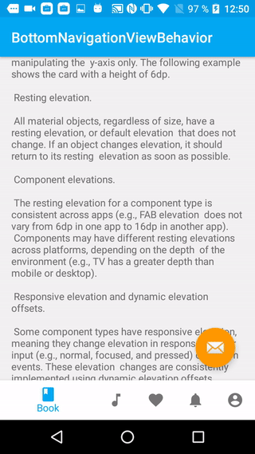

# BottomNavigationBehavior

## Synopsis 

I use BottomNavigationWidget but Google doesn't provide behavior like we can see in (Google Material Guidelines [Bottom Navigation](https://material.io/guidelines/components/bottom-navigation.html)). So I Made a behavior and applied it on BottomNavigationView.

## How

I define a behavior wich is like bottomsheetbehavior when it's hiding or expdand. 

## What it does ? 

* Hide/expand on scroll
* Fixed mode
* Manage snackbar and FAB in all state (expanded, hidden or settling)
* A helper to disable shiftmode

## TODO

* Correct bug when snackbar is dimissed on swipe
* Coorect FAB bug when scnackbar is dimissied
* Circular background color reveal
* Disable shiftmode by xml parameter
* Add behavior and a simple method to allows circular reveal background color change on item click

## Screenshot

